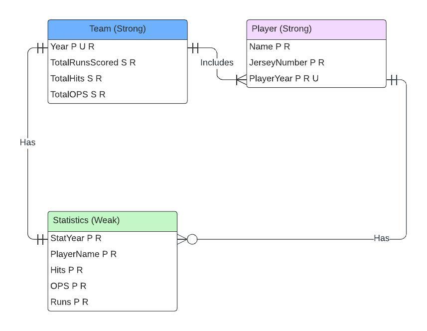

# CIS3103-Project-AllyRyan
CIS-3103-Database Program Development Final Project 

We connect baseball statistics beteween the last 23 World Series champions. We keep track of team, player, and statistics. Each team has players, aggregate statistics, and a year. Each player has a name, jersey number, and year. The statistics we value are number of hits, on base percentage, and number of runs. Each team has up to 26 players. Each player must have a unique jersey number in each year. Each jersey number must be 1 or 2 digits. We are seeking to find a correlation between the champion's statistics (as stated above) that shows whether there is a minimum value visualized between the winners in the last 24 years. 

# Entities, relationships, attributes
## Entity 1 - Team
Attributes 
- YearDate PRIMARY KEY
- Total runs scored 
- Total hits collected 
- Total OPS 

## Entity 2 - Player
Attributes
- Name
- JerseyNumber
- PlayerYear FOREIGN KEY

## Entity 3 - Statistics
Attributes
- StatYear
- PlayerName
- Hits
- OPS (On base percentage + slugging)
- Runs

## Relationships
- Team-Includes-Player
- Player-Has-Statistics
- Team-Has-Statistics

# Glossary Information
## Attribute types
- Name: NAME
- PlayerName: NAME
- JerseyNumber: SMALLINT UNSIGNED
- YearDate: DATE
- PlayerYear: DATE
- StatYear: DATE
- Hits: SMALLINT UNSIGNED
- OPS: FLOAT(4, 3) UNSIGNED
- Runs: SMALLINT UNSIGNED
- Total runs scored: SMALLINT UNSIGNED
- Total hits collected: SMALLINT UNSIGNED
- Total OPS: FLOAT(4, 3) UNSIGNED

## Document names, synonyms, descriptions
- Name/playerName - Name of player on Red Sox
- JerseyNumber - The number the player wears when he plays
- YearDate/date - year of the specific team, year a specific player was on that year's team
- Hits/basehit - a statistic describing a basehit in baseball
- OPS/on base plus slugging - on base plus slugging is a calculated statistic that combines on base percentage with slugging percentage
- Runs - the number of times a player crosses home plate to score a run for the Red Sox
- Total runs scored - a sum of all runs scored by each player for a specific year
- Total hits collected - a sum of all the hits collected by each player for a specific year
- Total OPS - calculated average OPS (on base plus slugging) between all players for a specific year

## Description of Data
The data includes three csv files that each contain extended statistics for the Red Sox in their latest 3 World Series Championships (2007,2013, 2018). The data includes values as listed in the following line
    Rk,Pos,Name,Age,G,PA,AB,R,H,2B,3B,HR,RBI,SB,CS,BB,SO,BA,OBP,SLG,OPS,OPS+,TB,GDP,HBP,SH,SF,IBB,Name-additional

## Relationship maxima and minima
### Team-Includes-Player
#### Minima
- one-one
#### Maxima
- singular-plural
### Player-Has-Statistics
#### Minima
- one-zero
#### Maxima
- singular-plural
### Team-Has-Statistics
#### Minima
- one-one
#### Maxima
- singular-singular

## Attribute maxima and minima
- YearDate - plural, required
- PlayerYear - plural, required
- Total Runs Scored - singular, required
- Total Hits - singular, required
- Total OPS - singular, required
- Name - plural, required
- JerseyNumber - plural, required
- PlayerName - plural, required
- Hits - plural, required
- OPS - plural, required
- Runs - plural, required

## Identify unique attribute
- YearDate - unique 
- PlayerYear - unique

## Strong and weak entities
- Team (Strong)
- Player (Strong)
- Statistics (Weak)

## Identifying relationships
- Players-Have-Statistics

## ER Diagram
